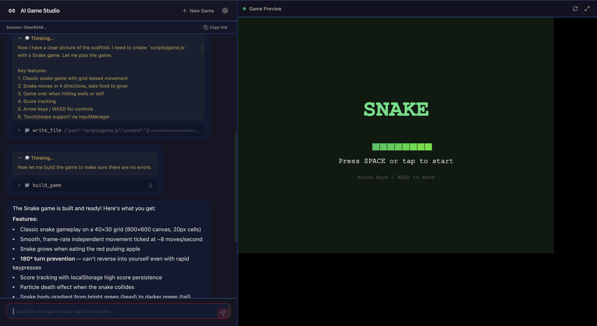

# 🎮 AI Game Studio

> **Natural Language to Playable Games — Chat to develop, see it play instantly.**
>
> *用自然语言创造 HTML5 游戏 — 对话即开发，所见即所得。*

<p align="center">
  
  
  
  
  
  
</p>

<p align="center">
  
</p>

<p align="center">
  
  
  
  
</p>

---

## ✨ Core Capabilities

<table>
<tr>
<td width="50%">

### 💬 Natural Language Driven
Describe your game in Chinese or English — *"Make a neon-styled snake game"*, *"Build a space shooter with particles"*. The agent reads scaffold documentation, studies templates, and generates optimized code.

### 🤖 Subagent Delegation
The agent spawns up to 3 research subagents for low-signal-to-noise tasks — reading documentation, searching code patterns, gathering context — freeing the main agent for high-level game design decisions.

### 🧪 Automated Testing
`game_runtime` loads the built game in a headless Chromium browser, uses the fallback model to play it at controlled FPS, and reports edge-case issues: boundary collisions, game-over triggers, canvas sizing, score stagnation.

</td>
<td width="50%">

### ⚡ Streaming Generation
Every tool call, reasoning chain, and code output streams in real-time. The entire development process is transparent — not a black box.

### 🛡️ Model Resilience
Built-in fallback mechanism: when the primary model (deepseek-v4-pro) is unavailable, the system automatically retries with the fallback (deepseek-v4-flash) — for both the main agent loop and subagent delegation.

### 📋 Todo Visualization
Game plans are extracted from `todo.md` and rendered as interactive progress cards in the chat — progress bar, checkbox list with completion status, and next-task indicator.

</td>
</tr>
</table>

### Additional Features

| Feature | Description |
|---|---|
| 🎮 **Instant Preview** | Sandboxed iframe runs your game immediately. Keyboard, mouse, touch support. Fullscreen. |
| 🔄 **Iterative Refinement** | Multi-turn conversations refine every aspect — speed, scoring, visuals, mechanics. |
| 🧠 **Knowledge Flywheel** | 4 game templates, 20+ gotcha rules, complete Canvas UI guide. Utils and gotchas are agent-extensible. |
| 📦 **Self-Contained Builds** | All scripts + assets → single HTML file. Zero external dependencies. Pure Canvas + JavaScript. |
| 🔌 **BYO-Key Architecture** | Bring your own DeepSeek API key. No server-side key storage. OpenAI-compatible endpoints supported. |
| 🌐 **Session Persistence** | JSONL file-based persistence survives server restarts. `?session={id}` restores full conversation + game state. |

---

## 🚀 Quick Start

```bash
git clone https://github.com/1998x-stack/ai-game.git
cd ai-game
npm install
npm run dev
# Open http://localhost:3000
# Configure your DeepSeek API Key → Start creating games
```

**Prerequisites**: Node.js 18+ | [DeepSeek API Key](https://platform.deepseek.com/)

---

## 🏗️ Architecture

```
┌──────────────────────────────────────────────────────────────────┐
│                        AI Game Studio                             │
├──────────────────────┬───────────────────────────────────────────┤
│   Chat Panel (left)  │          Game Preview (right)              │
│                      │                                            │
│  ┌────────────────┐  │  ┌─────────────────────────────────────┐  │
│  │ User: "Make a  │  │  │                                     │  │
│  │   snake game"  │──┼─▶│   ┌───────────────────────────┐    │  │
│  └────────────────┘  │  │   │  🐍 Snake Game             │    │  │
│                      │  │   │  (sandbox iframe)          │    │  │
│  ┌────────────────┐  │  │   └───────────────────────────┘    │  │
│  │ Agent:          │  │  │                                     │  │
│  │  📁 read_file  │◀─┼──│   Score: 42  Level: 3              │  │
│  │  ✏️ write_file │  │  │                                     │  │
│  │  🔍 grep_file  │  │  │   [Error Console]                  │  │
│  │  🤖 delegate   │  │  │                                     │  │
│  │  🔨 build_game │  │  │   [Todo Card: 3/5 done]            │  │
│  │  🧪 game_rt    │  │  └─────────────────────────────────────┘  │
│  │  ✅ Build OK!   │  │                                            │
│  └────────────────┘  │                                            │
├──────────────────────┴───────────────────────────────────────────┤
│                   Agent Pipeline (11 tools)                        │
│   System Prompt → Scaffold Docs → Gotchas → Templates → Tool Loop  │
│         ↓                     ↓                                    │
│   scripts/game.js      build_game → output/index.html              │
│         ↓                     ↓                                    │
│   /api/preview/{id} → iframe   game_runtime → Playwright → Test    │
└────────────────────────────────────────────────────────────────────┘
```

### Tech Stack

| Layer | Technology |
|---|---|
| Framework | Next.js 14 (App Router) |
| Language | TypeScript 5.4 |
| Styling | Tailwind CSS 3.4 |
| Agent SDK | DeepSeek API (OpenAI-compatible) |
| Testing | Playwright (headless Chromium) |
| Game Engine | Pure HTML5 Canvas + JavaScript |
| Sandbox | iframe `allow-scripts` |
| Persistence | JSONL files + in-memory Map |

### Agent Tool Registry (11 tools)

| Tool | Parameters | Purpose |
|---|---|---|
| `read_file` | `path`, `offset`, `limit` | Read files (2K-line default) |
| `write_file` | `path`, `content`, `overwrite` | Write files (overwrite-protected) |
| `edit_file` | `path`, `old_str`, `new_str` | Unique-match text replacement |
| `list_directory` | `path` | List with deterministic format |
| `grep_file` | `path`, `pattern`, `context` | ripgrep search (JS fallback) |
| `build_game` | — | Package scripts → HTML |
| `load_skills` | — | Discover workspace skills |
| `write_todo` | `tasks[]` | JSON tasks → checklist |
| `set_error` | `message` | Report unrecoverable errors |
| `delegate_subagent` | `instruction` | Spawn research subagents (max 3) |
| `game_runtime` | `maxSteps`, `fps` | Automated edge-case testing |

---

## 📂 Project Structure

```
ai-game/
├── app/                          # Next.js pages + API routes
│   ├── page.tsx                  # Dynamic import entry (SSR disabled)
│   ├── HomeContent.tsx           # Split-panel layout + state management
│   ├── layout.tsx                # Root layout
│   └── api/
│       ├── chat/route.ts         # Agent chat (POST, SSE streaming)
│       ├── build/route.ts        # Manual build (POST)
│       ├── preview/[id]/route.ts # Game preview (GET, iframe source)
│       └── session/[id]/route.ts # Session history (GET, JSONL reader)
├── components/                   # React components
│   ├── ChatPanel.tsx             # Chat panel + Markdown + TodoCard
│   ├── GamePreview.tsx           # Sandbox iframe + fullscreen
│   ├── SettingsModal.tsx         # API key configuration
│   └── ErrorConsole.tsx          # Runtime error display
├── lib/                          # Core libraries
│   ├── agent/                    # Agent SDK (factory + DeepSeek adapter)
│   │   ├── types.ts              # Type definitions + StreamEvent
│   │   ├── tools.ts              # 11 tool definitions + handlers
│   │   ├── factory.ts            # Provider factory
│   │   ├── deepseek.ts           # DeepSeek agent (fallback-aware)
│   │   └── index.ts              # Barrel export
│   ├── build/packager.ts         # scripts + assets → single HTML
│   ├── workspace/manager.ts      # Session isolation + scaffold copy
│   ├── scaffold/reader.ts        # Scaffold document loader
│   └── session-store.ts          # JSONL persistence
├── workspace/                    # Scaffold knowledge base
│   ├── agent.md / claude.md      # Agent system instructions
│   ├── docs/                     # 4 game development guides
│   ├── templates/                # 4 game templates (snake, breakout, tetris, 2048)
│   ├── lib/utils.js              # 19 reusable engine classes/functions
│   └── skills/                   # Extensible skill system
├── docs/                         # Project documentation
│   ├── architecture.md           # System architecture
│   ├── agent-sdk.md              # Agent SDK reference
│   ├── tool-analysis.md          # Comprehensive tool analysis
│   ├── scaffold-system.md        # Scaffold system design
│   ├── skills-system.md          # Skill system design
│   └── adr/                      # Architecture Decision Records
├── assets/                       # GitHub Pages landing page
├── __tests__/                    # 84 test cases (Vitest)
└── CONTEXT.md                    # Domain context glossary
```

---

## 🎯 Design Philosophy

| Principle | Practice |
|---|---|
| **Scaffold-First** | Agent reads authoritative docs + gotchas + templates before generating code |
| **Knowledge Flywheel** | Utils, gotchas, and skills are agent-extensible — every solved problem becomes reusable knowledge |
| **Pure Canvas** | Zero WebAssembly, zero game frameworks — generated games are standalone HTML files |
| **BYO-Key** | No server-side key storage — API key lives only in browser localStorage |
| **Defense in Depth** | Four-layer path validation: `..` rejection → `user_space/` check → boundary check → symlink resolution |
| **Model Resilience** | Automatic failover to fallback model on API errors — main loop and subagents |
| **Deterministic Tools** | `formatDirectoryListing()` function guarantees output format — not just prompt-constrained |

---

## 🤝 Contributing

1. Read [CONTEXT.md](./CONTEXT.md) — understand the domain model
2. Read [DEVELOPMENT.md](./DEVELOPMENT.md) — developer gotchas and conventions
3. Extend the scaffold — add new templates, gotchas, or skills under `workspace/`
4. Add a new LLM provider — implement `AgentSession` interface (see `lib/agent/deepseek.ts`)
5. Add a new tool — define + register in `lib/agent/tools.ts` (see `docs/tool-analysis.md`)

**30+ gotchas documented** — covering canvas sizing, module scoping, event handling, text rendering, collision detection, and more.

---

## 📄 License

MIT © 2024 AI Game Studio

---

<p align="center">
  <sub>Built with ❤️ using <a href="https://nextjs.org">Next.js</a> · <a href="https://platform.deepseek.com">DeepSeek</a> · <a href="https://tailwindcss.com">Tailwind CSS</a> · <a href="https://playwright.dev">Playwright</a></sub>
</p>
